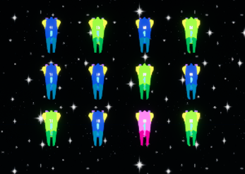

# Space Invaders

This project contains a custom implementation of the _Space Invaders_ game developed with Unreal Engine 5. 

## Development notes

TODO

### 👾 Multiple agent types in invader squads

Although changes between the different invader types lie mostly in aesthetics, squads can now contain a mix of invader variants.

In order to implement this feature, a few additional blueprint classes were created to inherit from the base `Invader` class. 

As mentioned earlier, there is no difference on the actual implementation of these invader types. Changes have been applied to their materials, so each of them has a different color and it's easy to tell them apart. Also, the value for the _"Fire Rate"_ property is slightly different, so some invader types are more likely to shoot than others. 

The list of variants is as follows:

1. `BP_Invader` (pink colored, highest fire rate)
2. `BP_InvaderB` (green colored, lowest fire rate)
3. `BP_InvaderC` (blue colored, average fire rate)

Once the different variants were created, modifications were made to the `InvaderSquad` class so it was possible for squads to contain invaders of the different types chosen at random.

The `invaderClass` property which was previously used to configure which invader class was to be used to generate the squad was replaced by `invaderClasses`, which receives an array with the following data:

- `invaderClass`: An invader class which needs to inherit from `AInvader`.
- `spawnOdds`: A numeric which can be used to add a weight to the type, and specify which should be more likely to appear in squads. The largest the number, the more common it would be to have this type of invader inside our squads. On the other hand, invaders with lower odds may be rare to encounter and could even be missing from some squads.

These two methods have been added to work with this new data:

### `InitializeInvaderTemplates`

As its name implies, this method will be used to **generate a template for each one of the types** we assign to the `invaderClasses` array.

This method contains some safety checks, so a default template based on the base `AInvader` class is created in case `invaderClasses` is empty. This default template will also be used as a fallback in case any of the specified `invaderClasses` is deemed invalid. This will prevent the game from crashing because of uncontrolled `nullptr` errors.

All generated templates will be stored in a `invaderTemplates` array which will be later used when generating all the squad members.

Aside from the templates, this method also handles the initialization of another structure, a numeric array called `oddsArray` which will be explained in the next section.

### `FetchRandomInvaderTemplate`

The aim of this method is to **randomly pick up any of the templates on the list**, and return it so that we can obtain squads that combine different variants. This will be used when instantiating each of the squad members in the `BeginPlay` method.

The `oddsArray` container is specially relevant here, as it'll be used to implement a pretty simple mechanism that guarantees that some invader types have higher chances to appear than others.

Contents of this `oddsArray` will be repetitions of each index in the `invaderTemplates` array. `FetchRandomInvaderTemplate` will merely pick up a random item out of `oddsArray`, and its value will determine which template will be returned. As classes with higher odds will appear more times in `oddsArray`, this means it's more likely for the randomly chosen value to return it.

Let's illustrate how this simple algorythm works with an example based upon this data:

- Class `InvaderA` in index `0` with `spawnOdds` = `1`
- Class `InvaderB` in index `1` with `spawnOdds` = `2`
- Class `InvaderC` in index `2` with `spawnOdds` = `3`

After initialization, `oddsArray` would contain the following:

```
0, 1, 1, 2, 2, 2
```

As we can see there, `InvaderA` only shows up once in the array, whereas `InvaderC` is repeated three times. When we call the function to fetch a random index in `oddsArray`, thus, it'd be more common for us to encounter invaders of type `InvaderC` than to see some of `InvaderA`.

With this particular data set it's highly likely we'll encounter the three types, although it can already be observed that pink invaders are far less common than green or blue ones. 



If we play around with the numbers and increase the odds of other types, we'll notice how it happens more often that pink invaders are completely missing from the squads.

## Additional project information

### 🖥️ Project specs

- **Unreal Engine:** 5.3.1
- **Operating System:** Windows 10, 64 bits

### 🎨 Resources

- [Space Invaders - UE4](https://github.com/iestevez/spaceinvaders)

### 🔗 References

- [Space Invaders - UE5](https://github.com/iestevez/spaceinvaders_ue5)
