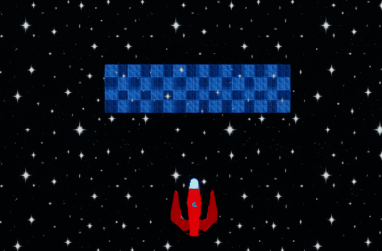

# Space Invaders

This project contains a custom implementation of the _Space Invaders_ game developed with Unreal Engine 5. It was created for educational purposes as one of the projects for the [videogame development degree](https://www.ull.es/masteres/desarrollo-videojuegos/) in University of La Laguna.

## About the game

In this game **the player will control a ship and gain points by surviving to the attacks of hordes of enemies** which move on squads. The more ships are taken down during the course of the game, the highest the player score will be.

Players will be able to move to the sides and shoot. Destroying invaders will be key to make dodging enemy attacks more easily and survive for longer periods of time, so this fire mechanic is key to achieve a good score.

### 🎮 Game controls

The following keyboard controls have be defined for this game:

| Action | Button |
| --- | --- |
| Move left | Left arrow |
| Move right | Right arrow |
| Shoot | Space |
| Pause game | Enter |

In case different controls are desired, these mappings can be reconfigured anytime in the _"Engine - Input > Bindings"_ section of the _"Project Settings"_ panel.

## Development notes

The current project has been development by using C++ classes together with Blueprints. Most core features of the game were developed following the tutorials in class, so this development report won't get into details about the initial steps. Instead, it'll focus only on the new features added to the base project.

However, a brief summary of the main C++ classes is listed below:

- `SIGameModeBase` defines a custom game mode which will be used in the game map. This is one of the key classes, were we'll define many of the delegate methods used to handle different in-game events and trigger a spawn of the enemy squads.

- `SIPawn` defines the behaviour of the player, implementing all of the controlled ship's mechanics.

- `SIInvader` defines the behaviour of each individual invader ship, including how it randomly initiates a new shoot or enters a free jump mode which will end up with its self-destruction.

- `SIBullet` defines the behaviour of the bullets that both the player and invaders can shoot.

- `SIInvaderSquad` spawns invaders to form a squad, and also handles the way they move. It ensures all invaders move in unison to the same direction, and also that they change direction when they reach any of the screen limits to the sides.

Two HUD widgets are also present in the game, with them being:

- `W_MenuHUD` contains all the visual elements and the behaviour of the main menu. This offers a button for the player to either close or start the game.

- `W_HUD` contains the HUD elements that will be displayed in-game, including the amount of lives the player has left and the score they have achieved so far.

### 👾 Multiple agent types in invader squads

Although changes between the different invader types lie mostly in aesthetics, squads can now contain a mix of invader variants.

In order to implement this feature, a few additional blueprint classes were created to inherit from the base `Invader` class.

As mentioned earlier, there is no difference on the actual implementation of these invader types. Changes have been applied to their materials, so each of them has a different color and it's easy to tell them apart. Also, the value for the _"Fire Rate"_ property is slightly different, so some invader types are more likely to shoot than others.

The list of variants is as follows:

1. `BP_Invader` (pink colored, highest fire rate)
2. `BP_InvaderB` (green colored, lowest fire rate)
3. `BP_InvaderC` (blue colored, average fire rate)

Once the different variants were created, modifications were made to the `InvaderSquad` class so it was possible for squads to contain invaders of the different types chosen at random.

The `invaderClass` property which was previously used to configure which invader class was to be used to generate the squad was replaced by `invaderClasses`, which receives an array with the following data:

- `invaderClass`: An invader class which needs to inherit from `AInvader`.
- `spawnOdds`: A numeric which can be used to add a weight to the type, and specify which should be more likely to appear in squads. The largest the number, the more common it would be to have this type of invader inside our squads. On the other hand, invaders with lower odds may be rare to encounter and could even be missing from some squads.

The two methods that make use of this new data are described in the sections below.

#### `InitializeInvaderTemplates`

As its name implies, this method will be used to **generate a template for each one of the types** we assign to the `invaderClasses` array.

This method contains some safety checks, so a default template based on the base `AInvader` class is created in case `invaderClasses` is empty. This default template will also be used as a fallback in case any of the specified `invaderClasses` is deemed invalid. This will prevent the game from crashing because of uncontrolled `nullptr` errors.

All generated templates will be stored in a `invaderTemplates` array which will be later used when generating all the squad members.

Aside from the templates, this method also handles the initialization of another structure, a numeric array called `oddsArray` which will be explained in the next section.

#### `FetchRandomInvaderTemplate`

The aim of this method is to **randomly pick up any of the templates on the list**, and return it so that we can obtain squads that combine different variants. This will be used when instantiating each of the squad members in the `BeginPlay` method.

The `oddsArray` container is specially relevant here, as it'll be used to implement a pretty simple mechanism that guarantees that some invader types have higher chances to appear than others.

Contents of this `oddsArray` will be repetitions of each index in the `invaderTemplates` array. `FetchRandomInvaderTemplate` will merely pick up a random item out of `oddsArray`, and its value will determine which template will be returned. As classes with higher odds will appear more times in `oddsArray`, this means it's more likely for the it to be chosen.

Let's illustrate how this simple algorythm works with an example based upon this data:

- Class `InvaderA` in index `0` with `spawnOdds` = `1`
- Class `InvaderB` in index `1` with `spawnOdds` = `2`
- Class `InvaderC` in index `2` with `spawnOdds` = `3`

After initialization, `oddsArray` would contain the following:

```
0, 1, 1, 2, 2, 2
```

As we can see there, `InvaderA` only shows up once in the array, whereas `InvaderC` is repeated three times. When we call the function to fetch a random index in `oddsArray`, thus, it'd be more common for us to encounter invaders of type `InvaderC` than to see some of `InvaderA`.

With this particular data set it's highly likely we'll encounter the three types, although it can already be observed that pink invaders are far less common than green or blue ones.


If we play around with the numbers and increase the odds of other types, we'll notice how it happens more often that pink invaders are completely missing from the squads.

### 💾 Preserving user's highest score

To make the highest score accessible from all levels in the game, a new class `SIGameInstance` was created to handle this data. The _"Project settings"_ have been modified to override the default game instance with this one, as illustrated in the screenshot below:


The `SIGameInstance` implements methods to fetch and update the highest score. Source of the data is not merely a fleeting property within the game instance itself: a `SISaveGame` inheriting from the base `SaveGame` class has also been created to make the score persist across multiple runs of the game.

`SISaveGame` is a pretty simple class with no implementation: it just contains the data structure that will be stored on disk and can be read anytime when the user wishes to resume the game. In this case, all we have is a numeric value with the highest score the user has managed to achieve so far.

The `SIGameInstance` will be the one in charge of loading this data and storing it into a save slot. It contains 3 methods:

- Class constructor, where we'll load the data from disk when the game starts. If no previous data is found, then a new save slot is automatically created.
- `GetHighestScore`, which retrieves the current score in the saved data object.
- `UpdateHighestScore`, which modifies the current value of `HighestScore` and persist the changes in the save slot.

Based upon these two new classes, the game code was then modified to show and update this information when needed.

For the updates, changes were made into the `OnPlayerZeroLifes` method of `SIGameModeBase`. Type of this delegate method was modified so that it receives the player score at the time the pawn triggers this event.

```c++
DECLARE_DELEGATE_OneParam(FOneLongIntParamDelegateSignature, int64)
FOneLongIntParamDelegateSignature PlayerZeroLifes;
```

In our event handler function, we then check if the obtained score exceeds the current highest score in memory. In case it beats the current record, the `UpdateHighestScore` is called to override its value with the new score before ending the game.

```c++
void ASIGameModeBase::OnPlayerZeroLifes(int64 playerScore)
{
    // Update highest score if current score exceeds previous record
    USIGameInstance* gameInstance = Cast<USIGameInstance>(this->GetGameInstance());
    int64 currentHighestScore = gameInstance->GetCurrentHighestScore();
    if (playerScore > currentHighestScore) {
        gameInstance->UpdateHighestScore(playerScore);
    }

    EndGame();
}
```

Once all logic was in place, the HUD in both the main menu and the game level were modified to display the highest score. A bind function was created to bind a new text element with the actual value of the highest score in our game instance.

Code for this bind function can be found in the _"Graph"_ view of the two widgets in the _"Widgets"_ folder of the project. Its implementation can be observed here:


The following video illustrates the final output after the described changes. There we can observe how a _"Highest score"_ text have been added to both levels in the game, as well as how its value changes after the player has died after obtaining a score that exceeds the previous record.


### ✨ Creating visual effects

To improve the game's look and feel, visual effects have been added in the following situations:

- The player ship is destroyed.
- The player shoots.
- An enemy ship is destroyed.
- An enemy ship shoots.

Niagara has been used to achieve this. First of all, new _"Niagara Emitter"_ instances were created into a _"FX"_ folder with the different particle effects thar we wanted to use on each use case. Then, on the _"Content browser"_ view, one _"Niagara System"_ per emitter was generated by right-clicking an emitter and choosing the option _"Create Niagara System"_.

These systems are what we'll use in our source code to run the effects when necessary. The following code illustrates how we're currently executing an explosion effect when the player dies:

```c++
// Trigger visual effect on explosion
if (ExplosionFX != nullptr) {
	UNiagaraFunctionLibrary::SpawnSystemAttached(ExplosionFX, RootComponent, NAME_None, FVector(0.f), FRotator(0.f), EAttachLocation::Type::KeepRelativeOffset, true);
}
```

Here, `ExplosionFX` is a reference to the Niagara System associated with the explosion effect emitter. System to use can be configured in the blueprints inheriting from `SIPawn` and `Invader` classes.

As for the effect displayed when either the player or an enemy ship fires a bullet, code in use is mostly the same. Difference lies, however, in that the effect is triggered into a different position. An empty `USceneComponent` element was added to both `SIPawn` and `Invader` classes to customize the spawn point for bullets, so they're not generated in the middle of the ship.

```c++
// Add scene component which can be used to customize the position in which bullets will be spawned
BulletSpawnPoint = CreateDefaultSubobject<USceneComponent>("BulletSpawnPoint");
BulletSpawnPoint->AttachToComponent(RootComponent, FAttachmentTransformRules::KeepWorldTransform);
```

We can choose the right position to spawn the bullets from the blueprint instances (like `BP_SIPawn`), based on the shape of our mesh. The following screenshots illustrates the location of the new spawn point defined for the player, which is now located on the front part of the ship.


Customization of this spawn point improved the result of adding a visual effect on shoot, as it becomes easier to notice in this new location.

Result of applying these special effects can be observed in the image below:


### 📈 Increasing difficulty

In order to make the difficulty of the game increase gradually based on the amount of squads that have been taken down, a new `baseSpeedIncrease` property has been added to the `SIGameModeBase`. Value of this property can be customized anytime in `BP_SIGameModeBase`.

The forementioned property will be used to increase the game difficulty every time a new squad is generated, making each squad move faster than the previous one. This is being done in this piece of code located in the `RegenerateSquad` method of `SIGameModeBase`:

```c++
// Increase speed of the new squad based on the amount of previously destroyed squads
if (numDestroyedSquads > 0) {
	float multiplier = 1.0f + ((float) numDestroyedSquads * baseSpeedIncrease);
	this->spawnedInvaderSquad->IncreaseSpeed(multiplier);
}
```

The `IncreaseSpeed` method of the `InvaderSquad` class will apply the specified multiplier to the following parameters:

- Squad's `horizontalVelocity` (to increase movement speed in the horizontal axis)
- Squad's `verticalVelocity` (to increase movement speed in the vertical axis)
- Each squad member's `fireRate` (to increase odds of them firing)

As we can see in the code above, the multiplier applied to the squad speed will be dependant on the amount of squads that have been destroyed so far (`numDestroyedSquads`). The more squads have been destroyed, the faster the newly generated squad will move.

The following picture illustrates the result by applying a `baseSpeedIncrease` of `1`. This means speed for the second squad will double the speed of the first, so it's easy to notice the difference between them on a short time span.


### 🎰 Adjusting rewards based on invader's death cause

In the game as it was after completing the tutorial, the user would always get points for any invader that was destroyed. This included, not only those that were destroyed by the player bullets, but also invaders who entered free jump mode and disappeared from screen.

Adjustments have been made in `SIPawn` so user doesn't get a full score for a invader whose death had nothing to do with them. Instead, they'll only get the maximum `pointsPerInvader` for invaders who really died by their hands.

In order to do this, the delegate function used for the `InvaderDestroyed` event has been modified to receive a boolean parameter indicating whether the invader was killed by the player or not. We'll make use of this new parameter to reward the user with a different amount of points based on the situation, as can be seen in the code below:

```c++
// Increase user score when a invader is destroyed
// Amount of awarded points will be reduced to half for invaders who self-destroyed
void ASIPawn::InvaderDestroyed(int32 id, bool killedByPlayer) {
	if (killedByPlayer) {
		this->playerPoints += this->pointsPerInvader;
	}
	else {
		this->playerPoints += this->pointsPerInvader * 0.5;
	}
}
```

### 🚧 Creating barriers

Two new C++ classes, `Barrier` and `BarrierSegment`, have been added to implement this feature. **Each barrier will be composed by multiple segments**, which will be actors in their own accord.

Content of the `Barrier` class will, similarly to the `InvaderSquad` class, spawn a set of items on a grid distribution. Number of rows and columns for this grid will be fully customizable, so one can create barriers with barely one or two segments, or larger ones that cover more space within the game map.

Behaviour of the segments is pretty straightforward: they'll merely render a mesh and detect collisions. When anything collides against one of these segments, they'll break and a visual effect will show before destroying the actor completely.

The following picture illustrates the way these barriers show up in the game:



As seen here, **bullets will self-destruct as soon as they collide with a barrier segment** and won't pass through the next one. For this to be possible, a small change was made to the `Bullet` class so that `BarrierSegment` is one of the tags that would cause them self-destruct. Without that change, bullets would simply pass through them and reach their final destination destroying anything on their way, which defied the whole point of having barriers set up in the map.

The only other thing worth mentioning about the way these classes were implemented is the mechanism to destroy the container `Barrier` object as soon as all its segments are destroyed.

Contrary to what happens with the squads, for which we'll have only one instance running at the same time, **it's possible for many barriers to co-exist in the scene simultaneously**.

For this reason, the `SegmentDestroyed` was not added to `SIGameModeBase` as the remaining events and, instead, was defined at `Barrier` level.

Having it defined at `SIGameModeBase` level caused issues, because all barriers within the scene will receive notification of a segment destruction, even if that segment belonged to a different barrier. This was a cause for many editor crashes (mostly when having barriers with different sizes) and also have some barriers self-destruct ahead of time, while some segments where still active on it.

In declaring the delegate function in the `Barrier` class, **it was possible to easily restrict communication from segments to their parent barrier**. Barrier instances should not care about segments being destroyed in other places, only about what happens to their own children.

To make this work, when spawning a segment a reference to their parent is stored in a `parent` property, which they'll later use to notify the appropiate barrier of their destruction.

```c++
// Remove barrier segment instance from scene
void ABarrierSegment::SelfDestruct() {
	if (parent != nullptr) {
		parent->SegmentDestroyed.ExecuteIfBound(segmentIndex);
	}

	Destroy();
}
```

## Additional project information

### 🖥️ Project specs

- **Unreal Engine:** 5.3.1
- **Visual Studio:** Community, 2022
- **Operating System:** Windows 10, 64 bits

### 🎨 Resources

- [Space Invaders - UE4](https://github.com/iestevez/spaceinvaders)
- [Space Invaders - UE5](https://github.com/iestevez/spaceinvaders_ue5)
- [Open Game Art: LAB textures](https://opengameart.org/content/lab-textures)

### 🔗 References

- [Unreal Engine Docs - Saving and loading your game](https://docs.unrealengine.com/5.3/en-US/saving-and-loading-your-game-in-unreal-engine/)
- [Awesometuts - Saving and loading game data in Unreal Engine](https://awesometuts.com/blog/save-load-game-data-unreal-engine/#elementor-toc__heading-anchor-8)
- [Epic Games Dev Community - Using Niagara in C++](https://dev.epicgames.com/community/learning/tutorials/Gx5j/using-niagara-in-c)